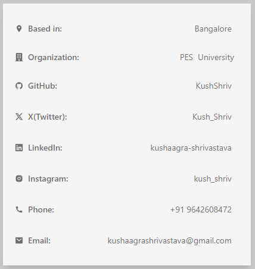
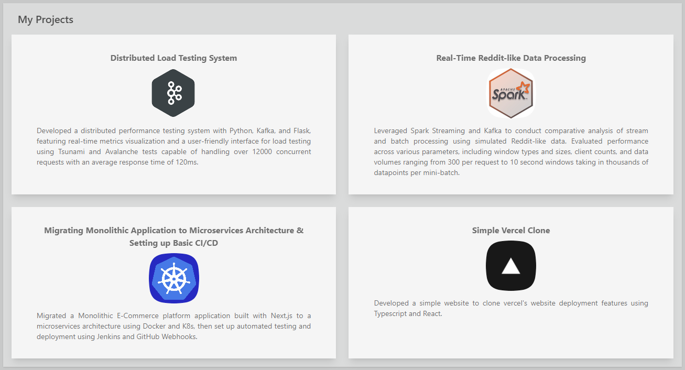
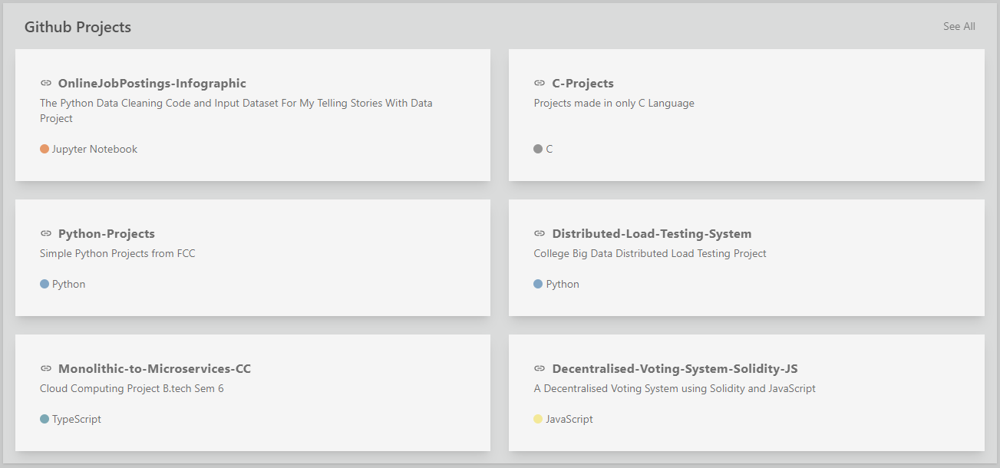

# Personal React Portfolio
Check the Portfolio [here](https://kushshriv.github.io) on  

---

This is my personal portfolio website where i display some of my projects, experience and education

This is currently a single static page made with various React Components

## Tech Stack Used

## Screenshots
#### Light Mode

#### Dark Mode

### Components - Current Configuration
#### Theme Changer

#### Avatar

#### Details

#### Education

#### Certifications

#### Tech Stack Card

#### My Projects

#### Experience

#### GitHub Projects

---

Inspired by and made using the help of [GitProfile](https://github.com/arifszn/gitprofile/)

This website and the code structure was inspired by and some were taken from GitProfile